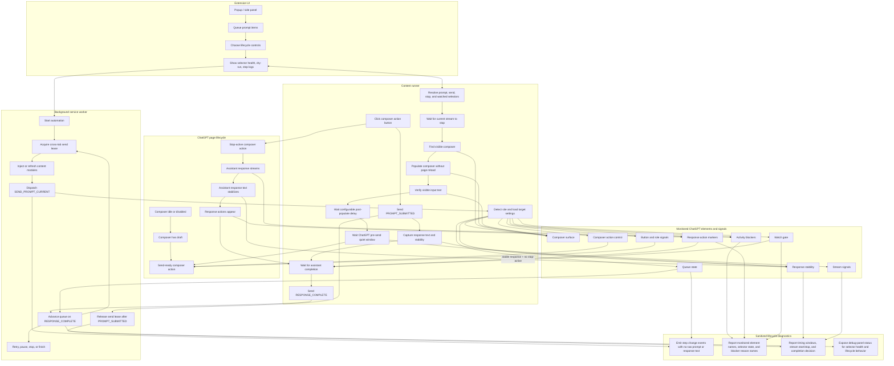

# ChatGPT + Extension Lifecycle Flow

Editable source: this file is plain Markdown. The diagram is Mermaid text, so update the nodes and edges when ChatGPT DOM states, monitored signals, or extension automation states change.

## Flowchart

## Lifecycle Controls

- `targetSelectors.promptInput`: controls how the visible composer is found.
- `targetSelectors.sendButton`: controls the send action target when default candidates drift.
- `targetSelectors.stopButton`: controls active generation detection, but `button#composer-submit-button` must be interpreted by role, not by stale attributes alone.
- `targetSelectors.watchedElement`: controls response-action completion evidence, normally copy/good/bad response buttons.
- `enableWatchedElementGate`: requires new response-action evidence before completion.
- `postPopulateDelayMinMs` / `postPopulateDelayMaxMs`: controls the pause between visible population and send.
- `crossTabSendLockMinWaitMs` / `crossTabSendLockMaxWaitMs`: controls random wait before another tab may click send.
- `perStepConsoleLogging`: emits sanitized lifecycle step logs.
- `dryRunPopulateOnly`: populates the composer but does not send.
- Future settings should also let the user control which monitored signals participate in gating, and how aggressive the lifecycle behavior should be, without changing code.

## Exact Selectors

- Composer surface: `div#prompt-textarea`, `textarea` fallback.
- Composer action control: `button#composer-submit-button`, `button[data-testid="send-button"]`, send-label variants.
- Button and role signals: `aria-label`, `title`, `data-testid`, `disabled`, `aria-disabled`, `role`.
- Response action markers: `button[data-testid="copy-turn-action-button"]`, `button[aria-label="Copy response"]`, `button[aria-label="Good response"]`, `button[aria-label="Bad response"]`.

## Current ChatGPT Invariants

- Visible composer is the `div#prompt-textarea` editor when present.
- Composer action is the current submit/stop control.
- The composer action can be send-ready, stop-active, disabled, or stale-mixed, so label/role checks matter more than raw selector presence.
- Loading shimmer and thinking indicators block while live, but stale tail-turn indicators stop blocking when stable response text and copy/good/bad action evidence exist and the composer is no longer stop-active.
- Active tool status and confirm dialogs remain hard blockers.
- Completion should rely on stable assistant response text plus response actions, not only on send button enabled state.
- Known response actions: copy-turn action button, `Copy response`, `Good response`, `Bad response`.
- Queue lifecycle tracks the current prompt, prompt-submitted handoff, and completion handoff back to the background service worker.
- Diagnostics must stay sanitized and detailed enough to explain stop/send composer role, response-action evidence, loading shimmer, thinking/tool status, confirm dialog, watched selector state, pre-send quiet window, stream start/stop, and completion decision without exposing raw content.
