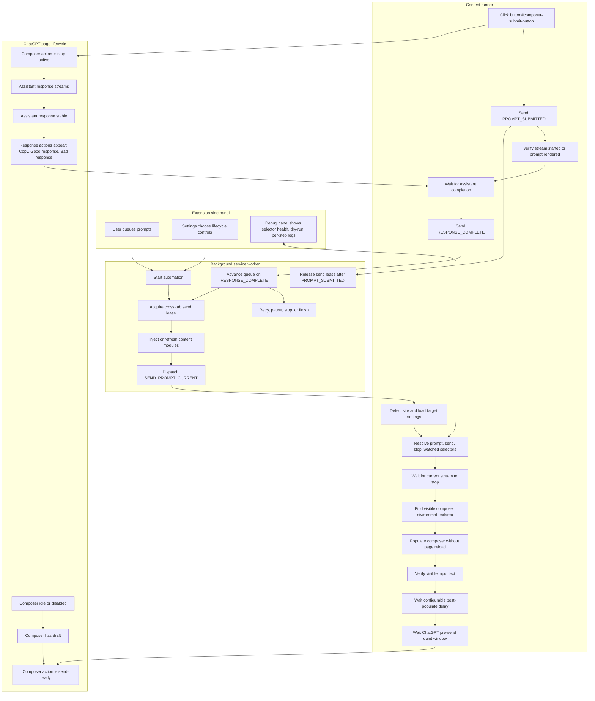

# ChatGPT + Extension Lifecycle Flow

Editable source: this file is plain Markdown. The diagram is Mermaid text, so update the nodes and edges when ChatGPT DOM states or extension automation states change.

## Flowchart

## Lifecycle Controls

- `targetSelectors.promptInput`: controls how the visible composer is found.
- `targetSelectors.sendButton`: controls the send action target when default candidates drift.
- `targetSelectors.stopButton`: controls active generation detection, but `button#composer-submit-button` must be interpreted by role, not by stale attributes alone.
- `targetSelectors.watchedElement`: controls response-action completion evidence, normally copy/good/bad response buttons.
- `enableWatchedElementGate`: requires new response-action evidence before completion.
- `postPopulateDelayMinMs` / `postPopulateDelayMaxMs`: controls the pause between visible population and send.
- `crossTabSendLockMinWaitMs` / `crossTabSendLockMaxWaitMs`: controls random wait before another tab may click send.
- `perStepConsoleLogging`: emits sanitized lifecycle step logs.
- `dryRunPopulateOnly`: populates the composer but does not send.

## Current ChatGPT Invariants

- Visible composer: `div#prompt-textarea`.
- Composer action: `button#composer-submit-button`.
- The composer action can be send-ready, stop-active, disabled, or stale-mixed.
- Completion should rely on stable assistant response plus response actions, not only on send button enabled state.
- Known response actions: `Copy response`, `Good response`, `Bad response`.
